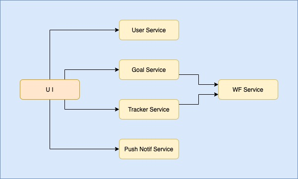

# Legilimens

## Objective
To extend to the learning from Habbit app both from tech and product perspective.
#### Product
Idea here to present an App where you can set goals, track progress on those goals, create sub goals have alerts around it with success criterion etc. Intention is also to allow
users to rate their goals and review the progress

#### Tech
Habbit was based out of Spring boot project and UI was on React JS. Here we will extend the to see imporovement in the UI alos few new components like Kafka and Temooral as a workflow
engine.
While you may question the usage here for some of the components, idea is to build understanding around these tools as well and hence may seem enforced but should be considered as a forced choice

## Design

## Implementation

### Project structure
Each service will have its own folder. Backend services will be in spring boot, will try to add least one service in GO at some point in time. These services will be deployable via docker containers and docker compose will be provided to stitch everything together.
